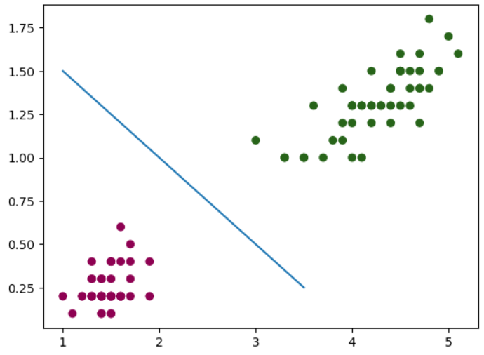

# Aprendizado de Máquinas

## Descrição do Projeto

Neste projeto, utilizamos o famoso dataset Iris, que é amplamente conhecido por quem trabalha com Machine Learning. O dataset pode ser encontrado em [Iris Dataset](https://scikit-learn.org/stable/modules/generated/sklearn.datasets.load_iris.html#sklearn.datasets.load_iris). O objetivo do projeto é aplicar algoritmos de aprendizado de máquina para classificar as espécies de flores Iris com base em suas características.

## Objetivo

O objetivo deste projeto é demonstrar o uso de algoritmos de aprendizado de máquina, como o Perceptron, para classificar dados e criar visualizações que ajudam a entender melhor os resultados do modelo. Através da análise e visualização do dataset Iris, buscamos ilustrar conceitos fundamentais de classificação em Machine Learning.

## Ferramentas Utilizadas

-   **Perceptron**: Algoritmo de aprendizado supervisionado usado para classificação.
-   **Matplotlib**: Biblioteca utilizada para a criação de gráficos.
-   **Seaborn**: Biblioteca utilizada para visualização de dados estatísticos, complementando o Matplotlib.

## Descrição dos Dados

O dataset Iris inclui as seguintes colunas:

-   **Sepal Length**: Comprimento da sépala.
-   **Sepal Width**: Largura da sépala.
-   **Petal Length**: Comprimento da pétala.
-   **Petal Width**: Largura da pétala.
-   **Species**: Espécie da flor (Iris Setosa, Iris Versicolour, Iris Virginica).

## Conclusões

1.  **Classificação das Espécies**
    
    -   Utilizamos o algoritmo Perceptron para treinar um modelo que classifica as espécies de flores Iris.
    -   As retas de separação foram criadas para visualizar a fronteira de decisão entre as diferentes classes.
    
2.  **Visualização dos Dados**
    
    -   Utilizamos Matplotlib e Seaborn para criar gráficos que ilustram a distribuição das características das flores e a eficácia do modelo de classificação.
    
3.  **Fronteiras de Decisão**
    
    -   As retas de separação nos gráficos ajudam a entender como o Perceptron classifica as diferentes espécies com base nas características das flores.

    
    

**Lembrete**: O código foi realizado na versão 3.11.7 do python
